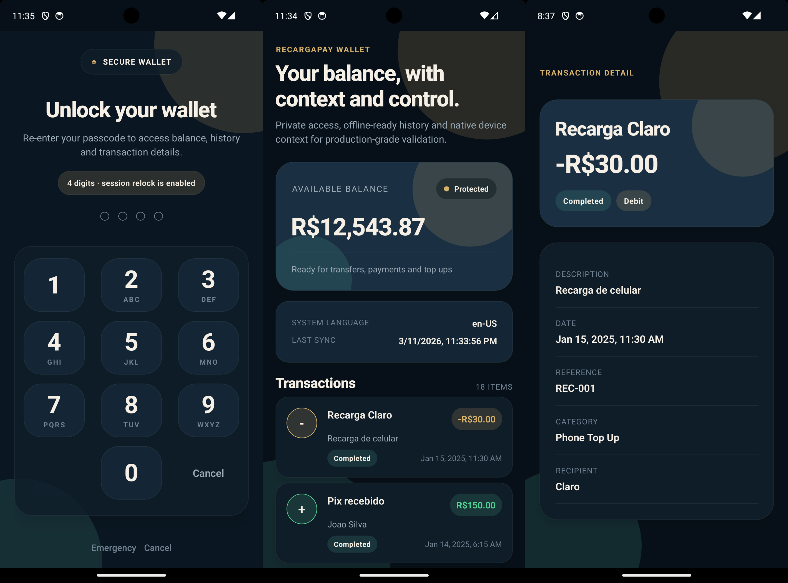

# RecargaPay IOS Screen


# RecargaPay Android Screen



# RecargaPay Wallet Challenge

React Native wallet application built for the RecargaPay mobile challenge.

The project focuses on:

- secure access through a user-defined PIN
- resilient wallet data loading with offline support
- native integration for device language and secure storage
- Redux-based state management with predictable flows
- OTA-safe fallbacks for native-module absence on older binaries

## Feature Summary

- first-launch PIN setup
- PIN unlock on subsequent sessions
- session relock on background and inactivity
- wallet dashboard with current balance and transaction history
- transaction detail screen
- operating system language display from native Android and iOS APIs
- offline-first wallet snapshot and automatic reconciliation
- analytics abstraction prepared for future providers

## Tech Stack

- React Native `0.84.1`
- React `19.2.3`
- Redux Toolkit
- React Navigation
- Styled Components
- TypeScript
- `json-server` for the local mock API
- custom native modules for:
  - device language
  - secure storage

## Architecture Overview

The app follows a simple layered structure:

1. `screens`
   UI entry points for each route. Screens use `styles.ts`, `types.ts`, and `useContainer.ts` when they need local orchestration.
2. `components`
   Reusable presentational building blocks such as balance cards, banners, and transaction rows.
3. `store`
   A single Redux Toolkit store with feature slices for `auth`, `wallet`, and `connectivity`.
4. `services`
   Platform-agnostic service layer for auth, wallet fetching, secure storage, device language, cache, and sync utilities.
5. `feature/analytics`
   Tracking abstraction that keeps business code decoupled from any analytics vendor.
6. `android` / `ios`
   Native modules used by JavaScript through guarded wrappers.

### State Management

The Redux store lives in `src/store/store.ts` and is intentionally split into three domains:

- `auth`
  handles bootstrap state, PIN session state, failed attempts, and relocking
- `wallet`
  handles balance, transactions, transaction details, cache hydration, sync state, and wallet errors
- `connectivity`
  tracks request-based online/offline state and the last successful sync timestamp

### UI Organization

The UI code uses a consistent separation pattern:

- `ComponentOrScreen.tsx`
  render layer
- `styles.ts`
  styled-components definitions
- `types.ts`
  local props/contracts
- `useContainer.ts`
  local orchestration for screens that need behavior beyond rendering

## App Flow

### Authentication Flow

1. On startup, the app checks whether a PIN already exists.
2. If no PIN exists, the user goes through:
   - `CreatePin`
   - `ConfirmPin`
3. If a PIN exists but the session is locked, the user goes to `Unlock`.
4. Once unlocked, the user lands on `Wallet`.
5. The session is relocked when:
   - the app goes to background
   - inactivity exceeds the configured timeout

### Wallet Flow

1. The app attempts to hydrate the wallet from the latest cached snapshot.
2. A refresh is triggered against the mock API.
3. If the request succeeds:
   - Redux state is updated
   - the snapshot cache is replaced
   - connectivity state is marked as online
4. If the request fails:
   - cached data stays available when present
   - connectivity is marked as offline
   - the UI keeps the user informed
5. Transaction detail requests use:
   - in-memory detail cache first
   - network next
   - snapshot fallback last

## Data Contracts

The mock API is backed by `db.json` and provides:

- `GET /balance`
- `GET /transactions-history`
- `GET /transactions/:id`

The server is intentionally small and local so reviewers can run the full project without any external dependency.

## Native Modules

### Device Language

The app reads the current device language from native platform code instead of using third-party libraries for this requirement.

- Android: `android/app/src/main/java/com/recargapay/device`
- iOS: `ios/recargaPay/DeviceLanguageModule.swift`

JavaScript accesses this capability through `src/services/device/deviceLanguage.ts`, which is guarded for OTA compatibility.

### Secure Storage

PIN persistence uses custom native secure-storage modules:

- Android secure path: Keystore-backed storage
- iOS secure path: Keychain-backed storage

JavaScript consumes the capability through `src/services/secure/secureStorage.ts`.

If the native module is missing because the JS bundle is newer than the installed binary, the app falls back safely instead of crashing.

## Offline and Synchronization Strategy

- The last successful wallet snapshot is stored locally.
- The app can render cached balance and transaction history without network access.
- Background and foreground sync attempts reconcile the wallet automatically.
- The UI explicitly shows when cached data is being displayed.

This is designed to make the offline experience intentional, not accidental.

## Security and Privacy Notes

- PIN values are not stored in Redux.
- Transaction and balance payloads are not sent to analytics.
- Native secure storage is preferred whenever the binary supports it.
- The AsyncStorage fallback exists only as an OTA compatibility bridge for older binaries and should not be considered the ideal security posture.

## OTA Compatibility Strategy

The project assumes multiple binary versions may coexist in production.

To avoid crashes when JavaScript is updated over the air:

- native modules are accessed through safe wrappers
- JS checks module availability before calling native APIs
- unsupported native capabilities degrade to safe defaults

Examples:

- device language falls back to platform locale metadata or `unavailable`
- secure storage falls back to AsyncStorage only when native secure storage is unavailable

## Project Structure

```text
.
├── android/                              # Android native modules and app shell
├── ios/                                  # iOS native modules and app shell
├── docs/adr/0001-wallet-architecture.md  # Architecture decisions and AI transparency
├── db.json                               # Mock API contracts and sample data
├── AGENTS.md                             # Repository execution/workflow rules
└── src/
    ├── components/                       # Reusable presentational components
    ├── config/                           # API configuration
    ├── feature/analytics/                # Analytics abstraction
    ├── i18n/                             # Translation and locale provider
    ├── routes/                           # Navigation setup
    ├── screens/                          # Route-level UI
    ├── services/                         # Auth, wallet, cache, device, secure storage
    ├── store/                            # Redux store, slices, selectors, hooks
    ├── styles/theme/                     # Theme tokens
    └── utils/                            # Formatting and shared helpers
```

## Prerequisites

- Node `>= 22.11.0`
- Yarn `1.x`
- Ruby/Bundler for iOS CocoaPods
- Android Studio and/or Xcode configured for React Native `0.84.x`

Use the repo version:

```sh
nvm use
```

## Installation

Install JavaScript dependencies:

```sh
yarn install
```

Install iOS native dependencies:

```sh
bundle install
bundle exec pod install --project-directory=ios
```

## Running the Mock API

The API uses the root `db.json` file.

Start it with:

```sh
yarn server
```

Default address:

- macOS / iOS simulator: `http://localhost:3000`
- Android emulator access from the app: `http://10.0.2.2:3000`

The Android special host is already handled in `src/config/api.ts`.

## Running the App

### Option A: start Metro and the mock server together

```sh
yarn dev
```

Then run one platform in another terminal:

```sh
yarn android
```

or

```sh
yarn ios
```

### Option B: start each process separately

Terminal 1:

```sh
yarn server
```

Terminal 2:

```sh
yarn start
```

Terminal 3:

```sh
yarn android
```

or

```sh
yarn ios
```

## Quality Checks

Run lint:

```sh
yarn lint
```

Run tests:

```sh
yarn test
```

Run TypeScript validation:

```sh
./node_modules/.bin/tsc --noEmit
```

## Test Coverage Scope

The unit test suite focuses on the most critical behaviors:

- auth bootstrap, PIN creation, unlock flow, and session relocking
- wallet offline bootstrap, sync flow, cache, and service contracts
- secure storage fallbacks
- device language fallbacks
- i18n provider behavior
- analytics abstraction

## Reviewer Notes

- The UI is intentionally pragmatic; the emphasis is on architecture, safety, and resilience.
- The mock server setup is deliberately frictionless and local-only.
- Native capabilities are isolated so OTA-related failure modes are explicit and controlled.

## Troubleshooting

### The app cannot reach the mock API on Android

Make sure the mock server is running locally and keep using the Android emulator. The project already maps Android requests to `10.0.2.2`, which points back to the host machine.

### iOS build fails after dependency changes

Reinstall pods:

```sh
bundle exec pod install --project-directory=ios
```

### The app starts but shows cached wallet data

This usually means the previous snapshot was loaded correctly but the latest network sync failed. Check whether `yarn server` is running on port `3000`.

## Additional Documentation

- `docs/adr/0001-wallet-architecture.md`
  architecture decisions, trade-offs, OTA strategy, and AI workflow transparency
- `AGENTS.md`
  local development and execution rules used during implementation
